<div align="center">

```
██████╗ ███████╗ ██████╗██████╗ ██╗   ██╗██╗████████╗██╗ ██████╗ 
██╔══██╗██╔════╝██╔════╝██╔══██╗██║   ██║██║╚══██╔══╝██║██╔═══██╗
██████╔╝█████╗  ██║     ██████╔╝██║   ██║██║   ██║   ██║██║   ██║
██╔══██╗██╔══╝  ██║     ██╔══██╗██║   ██║██║   ██║   ██║██║▄▄ ██║
██║  ██║███████╗╚██████╗██║  ██║╚██████╔╝██║   ██║   ██║╚██████╔╝
╚═╝  ╚═╝╚══════╝ ╚═════╝╚═╝  ╚═╝ ╚═════╝ ╚═╝   ╚═╝   ╚═╝ ╚══▀▀═╝ 
```

# **RecruitiQ Agency** 🤖
### *AI-Powered Resume Screening & Candidate Matching System*

> **A Smart College Project That Actually Works**  
> *Built with Python, Streamlit, and Local AI Models*

[](https://github.com/codexrahulKIIT/RecruitiQ-Agency-)
[](tel:+916202587293)
[](https://www.linkedin.com/in/rahulkumar-mca/)
[](mailto:rahulkr.tech247@gmail.com)

</div>

---

## 🎯 **What is This Project?**

**RecruitiQ Agency** is my college project that demonstrates how AI can make hiring smarter and faster. Instead of HR managers manually reading through hundreds of resumes, this system uses AI to automatically analyze resumes, match them with job requirements, and rank candidates based on how well they fit the role.

### **🚀 What Makes This Unique?**
- **Runs Completely Locally** - No data sent to external APIs, everything processes on your machine
- **Smart AI Analysis** - Uses advanced language models to understand both job requirements and candidate profiles
- **Real Resume Processing** - Handles actual PDF and DOCX resume files, not just text
- **Visual Interface** - Clean, professional web interface built with Streamlit
- **Practical Solution** - Solves a real-world problem that companies face every day

---

## 📸 **See It In Action**

<div align="center">

### **🎯 Main Application Interface**

*Clean, intuitive interface for uploading job descriptions and resumes*

### **☁️ AWS Deployment (Optional)**

*Deployed on AWS to show cloud deployment skills*

</div>

---

## ⚡ **Key Features I Built**

<div align="center">

| **🧠 AI Processing** | **📄 File Handling** | **🎨 User Interface** |
|:-------------------:|:--------------------:|:---------------------:|
| Analyzes job requirements automatically | Supports PDF and DOCX resumes | Clean, modern web interface |
| Matches candidates using NLP | Extracts text from documents | Real-time processing feedback |
| Scores and ranks candidates | Handles multiple file uploads | Responsive design |
| Explains why each match works | Processes various resume formats | Professional styling |

</div>

---

## 🛠️ **How to Run This Project**

### **📋 Prerequisites**
Before you start, make sure you have:
- **Python 3.8+** installed on your computer
- **Git** for cloning the repository
- **At least 4GB RAM** (for running AI models)
- **10GB free disk space** (for AI model downloads)

### **🚀 Step-by-Step Installation**

#### **1. Clone the Repository**
```bash
git clone https://github.com/codexrahulKIIT/RecruitiQ-Agency-.git
cd RecruitiQ-Agency-
```

#### **2. Set Up Python Environment**
```bash
# Create virtual environment
python -m venv recruitiq_env

# Activate it
# On Windows:
recruitiq_env\Scripts\activate
# On Mac/Linux:
source recruitiq_env/bin/activate
```

#### **3. Install Dependencies**
```bash
pip install -r requirements.txt
```

#### **4. Install and Setup Ollama (AI Engine)**
```bash
# Download Ollama from https://ollama.ai/
# Or use these commands:

# For Windows/Mac: Download installer from website
# For Linux:
curl -fsSL https://ollama.ai/install.sh | sh

# Pull the AI model (this will download ~4GB)
ollama pull llama2

# Start Ollama server
ollama serve
```

#### **5. Run the Application**
```bash
streamlit run app.py
```

#### **6. Open Your Browser**
Go to `http://localhost:8501` and start using the application!

### **📱 Quick Test**
1. Create a simple job description in the text area
2. Upload a few sample resumes (PDF or DOCX)
3. Click "Analyze Candidates"
4. See the AI-generated rankings and explanations

---

## 🎨 **How It Actually Works**

<div align="center">

### **🔄 RecruitiQ Processing Pipeline**

```mermaid
flowchart TD
    A["🏢 JOB DESCRIPTION<br/>📝 Requirements Input<br/>💼 Skills & Experience"] --> B["📁 RESUME UPLOAD<br/>📤 PDF/DOCX Files<br/>👥 Multiple Candidates"]
    
    B --> C["🔍 DOCUMENT PROCESSING<br/>📄 Text Extraction<br/>🔧 Format Parsing"]
    
    C --> D["🤖 AI JOB ANALYSIS<br/>🧠 Understanding Requirements<br/>🎯 Key Skills Identification"]
    
    D --> E["🧠 AI RESUME ANALYSIS<br/>📊 Candidate Profile Building<br/>🔍 Skills & Experience Mapping"]
    
    E --> F["⚖️ INTELLIGENT MATCHING<br/>🎯 Score Calculation<br/>📈 Ranking Algorithm"]
    
    F --> G["📊 RESULTS DASHBOARD<br/>🏆 Ranked Candidates<br/>💡 Match Explanations"]
    
    style A fill:#FF6B6B,stroke:#FF4757,stroke-width:4px,color:#fff
    style B fill:#4ECDC4,stroke:#00CEC9,stroke-width:4px,color:#fff
    style C fill:#45B7D1,stroke:#0984E3,stroke-width:4px,color:#fff
    style D fill:#96CEB4,stroke:#00B894,stroke-width:4px,color:#fff
    style E fill:#FFEAA7,stroke:#FDCB6E,stroke-width:4px,color:#333
    style F fill:#DDA0DD,stroke:#A29BFE,stroke-width:4px,color:#fff
    style G fill:#98D8C8,stroke:#00B894,stroke-width:4px,color:#fff
    
    classDef default font-weight:bold,font-size:12px
```



### **🚀 Step-by-Step Process Breakdown**

<table>
<tr>
<td align="center" width="16.66%">
<div style="background: linear-gradient(135deg, #FF6B6B, #FF4757); padding: 20px; border-radius: 10px; color: white; margin: 10px;">
<h4>🏢 STEP 1</h4>
<p><strong>Job Description</strong><br/>Define role requirements</p>
</div>
</td>
<td align="center" width="16.66%">
<div style="background: linear-gradient(135deg, #4ECDC4, #00CEC9); padding: 20px; border-radius: 10px; color: white; margin: 10px;">
<h4>📁 STEP 2</h4>
<p><strong>Upload Resumes</strong><br/>Add candidate files</p>
</div>
</td>
<td align="center" width="16.66%">
<div style="background: linear-gradient(135deg, #45B7D1, #0984E3); padding: 20px; border-radius: 10px; color: white; margin: 10px;">
<h4>🔍 STEP 3</h4>
<p><strong>Text Processing</strong><br/>Extract & clean data</p>
</div>
</td>
<td align="center" width="16.66%">
<div style="background: linear-gradient(135deg, #96CEB4, #00B894); padding: 20px; border-radius: 10px; color: white; margin: 10px;">
<h4>🤖 STEP 4</h4>
<p><strong>AI Analysis</strong><br/>Understand requirements</p>
</div>
</td>
<td align="center" width="16.66%">
<div style="background: linear-gradient(135deg, #FFEAA7, #FDCB6E); padding: 20px; border-radius: 10px; color: #333; margin: 10px;">
<h4>🧠 STEP 5</h4>
<p><strong>Resume Analysis</strong><br/>Profile each candidate</p>
</div>
</td>
<td align="center" width="16.66%">
<div style="background: linear-gradient(135deg, #DDA0DD, #A29BFE); padding: 20px; border-radius: 10px; color: white; margin: 10px;">
<h4>📊 STEP 6</h4>
<p><strong>Smart Results</strong><br/>Ranked with explanations</p>
</div>
</td>
</tr>
</table>

</div>

### **🔧 Technical Implementation**
- **Frontend**: Streamlit for the web interface
- **AI Engine**: Ollama running Llama2 model locally
- **File Processing**: PyPDF2 and python-docx for extracting text
- **Text Analysis**: Custom prompts for job-resume matching
- **Scoring**: Weighted algorithm based on skills, experience, and requirements

---

## 💻 **Tech Stack & Architecture**

<div align="center">

| **Layer** | **Technology** | **Why I Chose It** |
|:---------:|:--------------:|:------------------:|
| **🎨 Frontend** | Streamlit | Easy to build professional web apps with Python |
| **🧠 AI/ML** | Ollama + Llama2 | Runs locally, no API costs, privacy-focused |
| **📄 File Processing** | PyPDF2, python-docx | Handle real resume files in common formats |
| **🐍 Backend** | Python | Versatile, great AI/ML libraries |
| **☁️ Deployment** | AWS EC2 (optional) | Industry-standard cloud platform |
| **📊 Data** | In-memory processing | Simple, fast, no database complexity for demo |

</div>

---

## 🎓 **Project Learning Outcomes**

### **🧠 Skills Demonstrated**
- **AI/ML Integration** - Working with local language models
- **Full-Stack Development** - Frontend and backend implementation  
- **File Processing** - Handling various document formats
- **User Experience Design** - Creating intuitive interfaces
- **Cloud Deployment** - AWS hosting and configuration
- **Problem Solving** - Addressing real-world hiring challenges

### **🔍 Technical Challenges Solved**
1. **Local AI Processing** - Making AI work without expensive APIs
2. **File Format Handling** - Processing different resume formats reliably
3. **Performance Optimization** - Handling multiple resumes efficiently
4. **User Interface Design** - Making complex AI results easy to understand
5. **Deployment** - Getting everything running on cloud infrastructure

---

## 📊 **Project Specifications**

<div align="center">

### **⚡ Performance Metrics**

| **Feature** | **Specification** | **Notes** |
|:-----------:|:----------------:|:---------:|
| **Processing Speed** | ~10-15 seconds per resume | Depends on AI model and hardware |
| **File Support** | PDF, DOCX formats | Most common resume formats |
| **Concurrent Users** | 1-5 users | Suitable for demo and small teams |
| **AI Model Size** | ~4GB (Llama2) | Downloaded once, runs offline |
| **Memory Usage** | 2-4GB RAM | Moderate resource requirements |

</div>

---

## 🚧 **Current Status & Future Improvements**

### **✅ What's Working**
- Resume text extraction from PDF/DOCX files
- AI-powered job requirement analysis
- Candidate scoring and ranking
- Clean web interface
- Local deployment
- Basic AWS deployment

### **🔄 Potential Enhancements**
- **Database Integration** - Store job postings and results
- **User Authentication** - Multiple user accounts
- **Advanced Analytics** - Hiring trend analysis
- **Email Integration** - Send results to hiring managers  
- **Mobile Responsiveness** - Better mobile experience
- **Batch Processing** - Handle larger resume volumes

---

## 🎯 **Why This Project Matters**

### **🏢 Real-World Problem**
Hiring is expensive and time-consuming. Companies spend weeks screening resumes manually, often missing great candidates or making inconsistent decisions.

### **💡 My Solution**
An AI system that:
- Processes resumes 20x faster than humans
- Provides consistent, unbiased analysis
- Explains its reasoning for transparency
- Works offline for data privacy
- Costs nothing to run after setup

### **🎓 Academic Value**
This project demonstrates:
- Practical AI application
- Real file processing
- User interface design
- Cloud deployment skills
- Problem-solving approach

---

## 🤝 **Get in Touch**

<div align="center">

### **👨‍💻 About the Developer**

**Rahul Kumar** - MCA Student & Python Developer  
*Passionate about AI, Machine Learning, and solving real-world problems*

### **📞 Contact Information**

| **Channel** | **Details** | **Best For** |
|:-----------:|:-----------:|:------------:|
| **📱 Phone** | [+91 6202587293](tel:+916202587293) | Quick questions, project demos |
| **✉️ Email** | [rahulkr.tech247@gmail.com](mailto:rahulkr.tech247@gmail.com) | Detailed discussions, opportunities |
| **💼 LinkedIn** | [Professional Profile (1000+ views)](https://www.linkedin.com/in/rahulkumar-mca/) | Networking, career opportunities |
| **💻 GitHub** | [More Projects](https://github.com/codexrahulKIIT) | Code collaboration, other work |

</div>

---

## 📄 **Project Documentation**

### **📁 File Structure**
```
RecruitiQ-Agency/
│
├── app.py                 # Main Streamlit application
├── requirements.txt       # Python dependencies
├── README.md             # This file
├── config.yaml           # Configuration settings
├── utils/                # Helper functions
│   ├── file_processor.py # Resume text extraction
│   ├── ai_matcher.py     # AI matching logic
│   └── ui_components.py  # UI helper functions
├── assets/              # Images and static files
├── results/             # Screenshot examples
└── sample-data/         # Test resumes and job descriptions
```

### **🔧 Configuration**
The `config.yaml` file contains:
- AI model settings
- File upload limits
- UI customization options
- Deployment configurations

---

## 📜 **License & Usage**

This project is open source under the **MIT License**. Feel free to:
- ✅ Use it for learning
- ✅ Modify and improve it
- ✅ Use it in your own projects
- ✅ Share it with others

Just remember to give credit where it's due! 😊

---

<div align="center">

### **🌟 If This Project Helped You**

**Please ⭐ star this repository and share it with others!**

[](https://github.com/codexrahulKIIT/RecruitiQ-Agency-)
[](https://github.com/codexrahulKIIT/RecruitiQ-Agency-)

---

**💡 "Great projects start with simple ideas executed well"**

*Built with ❤️ for learning, sharing, and solving real problems*

**© 2024 Rahul Kumar | MCA Student | Python Developer**

</div>
